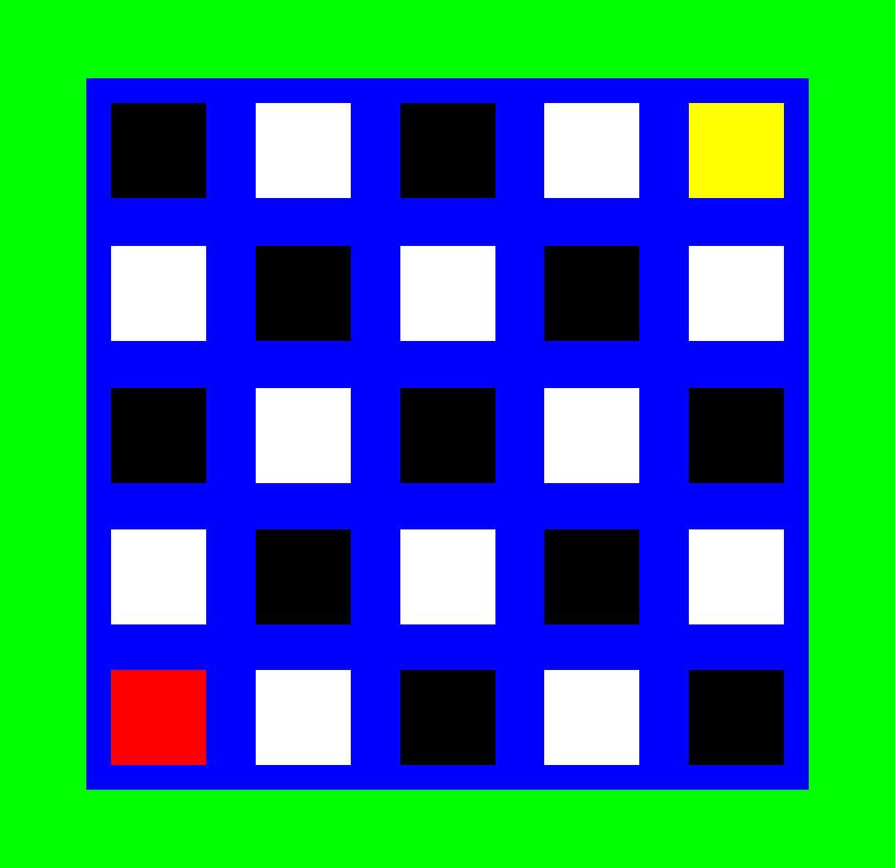

# Inspección del color del suelo

La primera misión para nuestro robot es inspeccionar el color del suelo, de acuerdo con la información de entrada del operador.
## Robot
Para esta misión vamos a usar el robot ***EV3 leJOS 0.9.1***

## Escenario
La misión se desarrolla en el escenario de la imagen adjunta. El escenario contiene una cuadrícula de estaciones, las cuales corresponden a posiciones en un plano cartesiano en donde la estación roja corresponde a la coordenada (0,0), y la estación amarilla corresponde a la coordenada (4,4). El robot debe iniciar su operación siempre en la estación roja. 

>[!NOTE]
>Pueden descargar la imagen del escenario para usarlo en sus simulaciones. 

## Misión

Dadas dos coordenadas, ingresadas como variables por el operador, el robot debe:
1.	Empezar su desplazamiento desde la estación roja `rgb(255,0,0)`. 
2.	Desplazarse hasta la estación indicada por las coordenadas. 
3.	Verificar si el color del suelo es blanco `rgb(255,255,255)` o negro `rgb(0,0,0)`. 
4.	Dirigirse hasta la estación de color amarillo `rgb(255,255,0)`. 
5.	Encender su LED con el color verde `rgb(0,255,127)` si la estación era blanca `rgb(255,255,255)`, o, con el color rojo `rgb(255,0,0)` si la estación era negra `rgb(0,0,0)`. 

