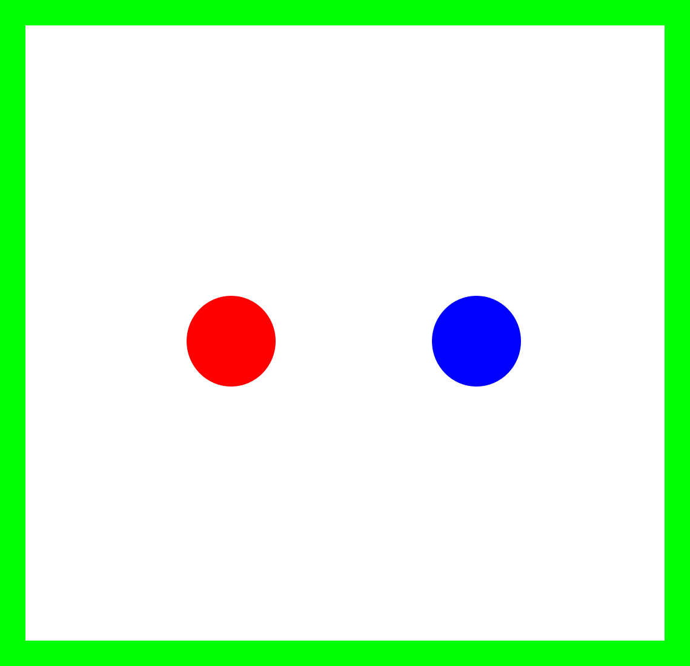

#  Foraging

La segunda misión para nuestro robot es Foraging: la actividad que vemos en insectos sociales en donde viajan desde un punto a otro para transportar alimento.  
## Robot
Para esta misión vamos a usar el robot ***EV3 leJOS 0.9.1*** 
## Escenario
La misión se desarrolla en un escenario que contiene dos regiones de interés: una región roja :red_circle: que representa la fuente de alimento, y una región azul :large_blue_circle:. que representa el nido al que deben transportarlo (ejemplo en imagen adjunta). Se entiende que el robot ha recogido 1 unidad de alimento cuando este entra en la fuente de alimento, y luego se desplaza y entra en el nido. Las posiciones de la fuente de alimento y el nido pueden cambiar, y esto no debe impedir que el robot cumpla su tarea. 

> [!IMPORTANT]
> El robot debe iniciar su operación siempre en el centro del escenario.

> [!NOTE]
> Pueden utilizar los ejemplos de los escenarios para usarlos en sus simulaciones (se dan 5 ejemplos de posiciones en el archivo zip). 

## Misión
Al iniciar la simulación el robot debe 
1.	Explorar su entorno. 
2.	Identificar las regiones de interés. 
3.	Recoger 10 unidades de alimento. 
4.	Detenerse e informar cuando haya terminado la misión.  

