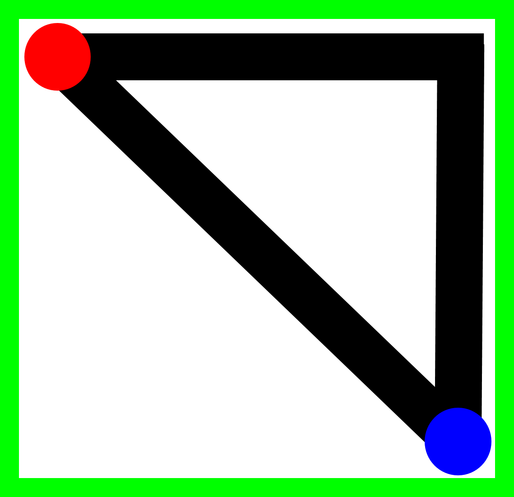

# Toma de decisiones

La tercera misión para nuestro robot es la toma de decisiones: un comportamiento que observamos en insectos que son capaces de encontrar el camino más corto entre una fuente de alimento y su nido. En esta misión se va a extender el concepto de **Foraging**, en dónde además de recoger alimento, el robot debe seleccionar el camino óptimo para hacerlo. 

## Robot 
Para esta misión vamos a usar el robot ***EV3 leJOS 0.9.1***.
## Escenario
La misión se desarrolla en un escenario que contiene dos regiones de interés: una región roja :red_circle: que representa la fuente de alimento, y una región azul :large_blue_circle: que representa el nido al que deben transportarlo. 
Las regiones están conectadas por dos caminos de diferente longitud; marcados con color negro :black_circle: (ejemplo en imagen adjunta). 

Se entiende que el robot ha recogido 1 unidad de alimento cuando este entra en la fuente de alimento, y luego se desplaza y entra en el nido. Las posiciones del nido y la fuente de alimento no cambian; pero _la posición y longitud de los caminos que las unen si pueden cambiar_. Esto no debe impedir que el robot cumpla su tarea.
>[!IMPORTANT]
> El robot debe iniciar su operación siempre en el nido, y por sí mismo, debe encontrar los dos caminos y determinar cuál es el óptimo. Dado que la posición y la longitud de los caminos puede variar, no es posible pre-programar el robot con rutas fijas.

## Misión
Al iniciar la simulación el robot debe:
1.	Recoger 10 unidades de alimento consecutivas utilizando el camino más corto. 
2.	Detenerse e informar cuando haya terminado la misión. 

> [!NOTE]
> Pueden utilizar los ejemplos de los escenarios para usarlos en sus simulaciones (se dan 3 ejemplos de escenarios en el archivo zip).

