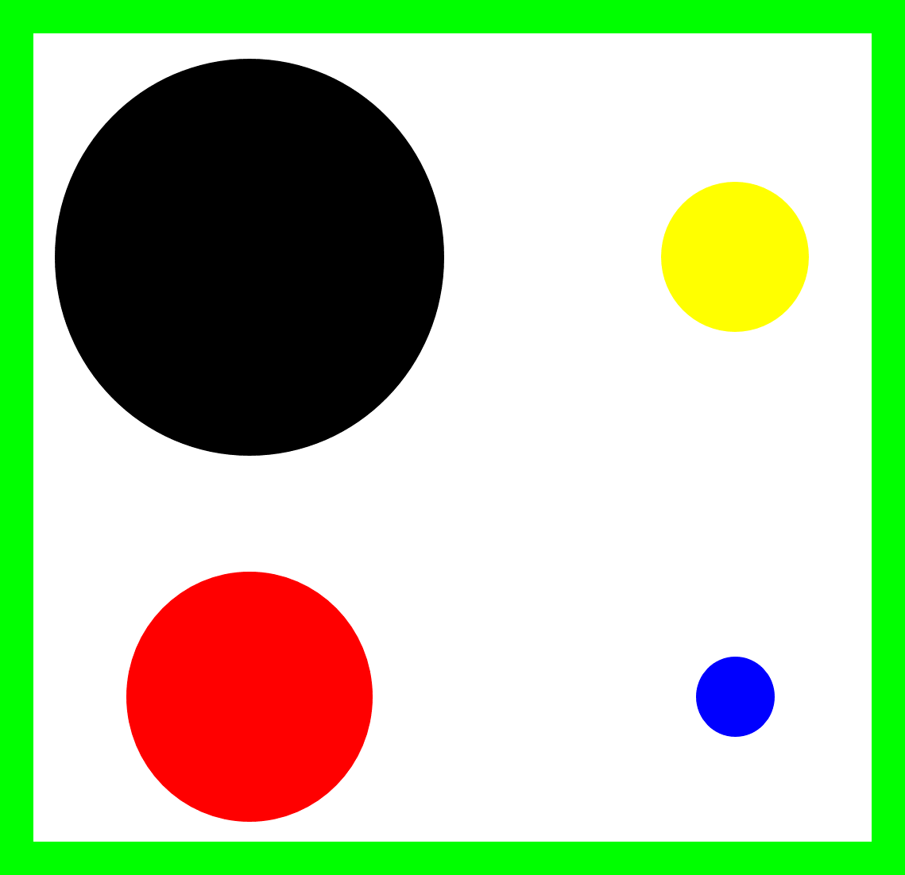

# Exploración

La cuarta misión para nuestro robot es exploración: al igual que en las misiones anteriores, aquí tomamos inspiración de comportamientos de animales sociales que son capaces de explorar su entorno, buscar fuentes de alimento, y dar valor a la fuente de alimento según sus características.  En esta misión, el robot debe explorar su entorno, identificar 4 fuentes de alimento, y caracterizarlas según su valor (tamaño de la fuente). 

## Robot 
Para esta misión vamos a usar el robot ***EV3 leJOS 0.9.1***.
## Escenario 
La misión se desarrolla en un escenario que contiene cuatro regiones de interés de diferentes colores (negra :black_circle:, azul :large_blue_circle:, roja :red_circle: y amarilla `:yellow_circle:). 

Las cuatro regiones representan fuentes de alimento, y pueden tener cuatro tamaños diferentes (pequeña, mediana, grande y gigante); ver ejemplo en la imagen adjunta.  Las combinaciones de color/tamaño pueden cambiar. Por ejemplo, un escenario puede tener una región roja/pequeña de alimento, mientras en otro escenario se puede encontrar una región roja/gigante de alimento.

> [!IMPORTANT]
> En todos los escenarios, existe una única combinación única de color/tamaño. 

El robot debe iniciar su operación siempre en el centro, y por sí mismo, debe identificar el tamaño de cada una de las fuentes de alimento. Es decir, debe diferenciar las cuatro fuentes, y avisar al operador cuál es el color y tamaño de cada fuente al finalizar la misión. 

La existencia de diferentes combinaciones de color/tamaño no debe impedir que el robot cumpla su tarea.

> [!NOTE]
> Pueden utilizar los ejemplos de los escenarios para usarlos en sus simulaciones (se dan 4 ejemplos de escenarios en el archivo zip).

## Misión
Al iniciar la simulación el robot debe:

1.	Explorar su entorno. 
2.	Identificar el color y tamaño de cada una de las cuatro fuentes de alimento. 
3.	Informar al operador del color y tamaño de cada una de las fuentes al terminar la misión.   

